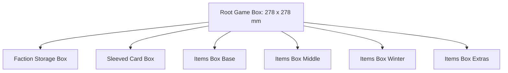

# Root Organizer Insert Specification

This document details the layout, component counts, compartment dimensions, and design rules for the **Root** board game organizer insert, ported from `examples/root.scad` to PythonSCAD.

---

## 1. Physical Box & Board Constraints

| Component | Width (mm) | Length (mm) | Height (mm) | Notes |
| :--- | :--- | :--- | :--- | :--- |
| **Main Game Box** | 290.0 | 290.0 | 82.5 | Outer dimensions of standard box. |
| **Playable Area (Interior)** | 278.0 | 278.0 | 79.5 | Wall clearance margins applied. |
| **Game Board** | 278.0 | 278.0 | 9.0 | Folded thickness, sits on top of inserts. |
| **Faction Boards** | 278.0 | 278.0 | 12.0 | Stack of 4–6 cardboard player boards. |

---

## 2. Component Inventory & Storage Sizing

### 2.1 Marquis de Cat
* **Color Scheme**: Orange (`#ff8c00`)
* **Warriors**: 25 meeples (stored laying flat in Marquis Box Bottom horizontal channels).
* **Buildings & Tokens** (stored in Marquis Box Top):
  * 1 Keep token (round base, `18.5 x 18.5 x 2.0 mm` cardboard, centered keep tower icon).
  * 6 Sawmills (square cardboard buildings, `18.5 x 18.5 x 2.0 mm` each).
  * 6 Workshops (square cardboard buildings, `18.5 x 18.5 x 2.0 mm` each).
  * 6 Recruiters (square cardboard buildings, `18.5 x 18.5 x 2.0 mm` each).
  * 8 Wood Log tokens (diameter `15.0 mm`, cylindrical wood pieces).
  * 1 Score marker (square cardboard wreath token, `18.5 x 18.5 x 2.0 mm`).
  * *Pocket style*:
    * Keep: Custom outline shape cutout using [`keep.svg`](file:///Volumes/ExternalDocs/Documents/GitHub/pythonscad_boxes/boxes/root/svg/keep.svg) (depth `2.0mm`).
    * Wood logs: 2 circular pockets (`CIRCLE`, size `15.0x15.0mm`, depth `8.0mm` for 4-high stacks) with [`log.svg`](file:///Volumes/ExternalDocs/Documents/GitHub/pythonscad_boxes/boxes/root/svg/log.svg) floor stamps.
    * Score marker: 1 rectangular pocket (`RECT`, size `18.5x18.5mm`, depth `2.0mm`) with [`laurel_wreath.svg`](file:///Volumes/ExternalDocs/Documents/GitHub/pythonscad_boxes/boxes/root/svg/laurel_wreath.svg) floor stamp.
    * Sawmills: 2 rectangular pockets (`RECT`, size `18.5x18.5mm`, depth `6.0mm` for 3-high stacks) with [`saw.svg`](file:///Volumes/ExternalDocs/Documents/GitHub/pythonscad_boxes/boxes/root/svg/saw.svg) floor stamps.
    * Workshops: 2 rectangular pockets (`RECT`, size `18.5x18.5mm`, depth `6.0mm` for 3-high stacks) with [`anvil.svg`](file:///Volumes/ExternalDocs/Documents/GitHub/pythonscad_boxes/boxes/root/svg/anvil.svg) floor stamps.
    * Recruiters: 2 rectangular pockets (`RECT`, size `18.5x18.5mm`, depth `6.0mm` for 3-high stacks) with [`handshake.svg`](file:///Volumes/ExternalDocs/Documents/GitHub/pythonscad_boxes/boxes/root/svg/handshake.svg) floor stamps.

### 2.2 Eyrie Dynasties
* **Color Scheme**: Blue (`#1e90ff`)
* **Warriors**: 20 Warriors meeples (stored in Erie Box Bottom channels).
* **Buildings**:
  * 7 Roosts (square cardboard roost icons, `18.5 x 18.5 x 2.0 mm` each, stacked up to 4-high in a `8.0 mm` deep well).
* **Tokens**: None
* **Other Pieces**:
  * 4 Leader Cards (stored in Erie card box).
  * 2 Vizier Cards (stored in Erie card box).
* *Pocket style*:
  * Warrior: Cutout shape matching [`erie_warrior.svg`](file:///Volumes/ExternalDocs/Documents/GitHub/pythonscad_boxes/boxes/root/svg/erie_warrior.svg).
  * Roost: Cutout shape matching [`tree.svg`](file:///Volumes/ExternalDocs/Documents/GitHub/pythonscad_boxes/boxes/root/svg/tree.svg).

### 2.3 Woodland Alliance
* **Color Scheme**: Green (`#228b22`)
* **Warriors**: 10 meeples (size: `18.5 x 18.5 x 10.0 mm` each).
* **Bases**: 3 cardboard base tokens (Fox, Rabbit, Mouse, size: `18.5 x 18.5 x 2.0 mm` each).
* **Sympathy Tokens**: 10 circular cardboard tokens (diameter `18.5 mm`, thickness `2.0 mm`).
* *Pocket style*: Faction icon engravings:
    * Alliance Eyes: [`alliance_eyes.svg`](file:///Volumes/ExternalDocs/Documents/GitHub/pythonscad_boxes/boxes/root/svg/alliance_eyes.svg)
    * Sympathy Fist: [`fist.svg`](file:///Volumes/ExternalDocs/Documents/GitHub/pythonscad_boxes/boxes/root/svg/fist.svg)

### 2.4 Vagabond
* **Color Scheme**: Grey/Brown (`#808080`)
* **Meeples**: 1–2 meeples (size: `18.5 x 18.5 x 10.0 mm` each).
* **Items**:
  * 3 Ruin items, 4 starting items, plus expansion items (swords, boots, bags, teapots, coins, hammers, torches).
  * Square cardboard tokens measuring `18.5 x 18.5 x 2.0 mm` each.
  * *Pocket style*: Rectangular grids (pocket depth: `4.0 mm` for 2-high stacks, `2.0 mm` for single items) with engraved item icons:
    * Sword: [`sword.svg`](file:///Volumes/ExternalDocs/Documents/GitHub/pythonscad_boxes/boxes/root/svg/sword.svg)
    * Boot: [`boot.svg`](file:///Volumes/ExternalDocs/Documents/GitHub/pythonscad_boxes/boxes/root/svg/boot.svg)
    * Bag: [`bag.svg`](file:///Volumes/ExternalDocs/Documents/GitHub/pythonscad_boxes/boxes/root/svg/bag.svg)
    * Teapot: [`teapot.svg`](file:///Volumes/ExternalDocs/Documents/GitHub/pythonscad_boxes/boxes/root/svg/teapot.svg)
    * Coins: [`coins.svg`](file:///Volumes/ExternalDocs/Documents/GitHub/pythonscad_boxes/boxes/root/svg/coins.svg)
    * Hammer/Workshop: [`anvil.svg`](file:///Volumes/ExternalDocs/Documents/GitHub/pythonscad_boxes/boxes/root/svg/anvil.svg)
    * Torch: [`torch.svg`](file:///Volumes/ExternalDocs/Documents/GitHub/pythonscad_boxes/boxes/root/svg/torch.svg)

### 2.5 Winter Clearing Markers
* **Total**: 12 cardboard tokens (4 Fox, 4 Rabbit, 4 Mouse).
* **Dimensions**: Crescent/C-shaped tiles measuring `15.5mm x 29.5mm x 2.0mm`.
* **Arrangement**: Stood vertically in 6 slots (2 tokens stacked per slot, pocket depth: `5.0 mm`).
* **Markings**: 0.6mm deep, 8x8mm suit stamp inlays at the bottom of circular tabs.
  * Pocket Outline: [`winter_token.svg`](file:///Volumes/ExternalDocs/Documents/GitHub/pythonscad_boxes/boxes/root/svg/winter_token.svg)
  * Slots 0-1: Fox suit stamp [`fox_suit.svg`](file:///Volumes/ExternalDocs/Documents/GitHub/pythonscad_boxes/boxes/root/svg/fox_suit.svg)
  * Slots 2-3: Rabbit suit stamp [`rabbit_suit.svg`](file:///Volumes/ExternalDocs/Documents/GitHub/pythonscad_boxes/boxes/root/svg/rabbit_suit.svg)
  * Slots 4-5: Mouse suit stamp [`mouse_suit.svg`](file:///Volumes/ExternalDocs/Documents/GitHub/pythonscad_boxes/boxes/root/svg/mouse_suit.svg)

---

## 3. Sub-Box Specifications

The insert is split into modular boxes arranged tightly in the main box footprint:

### 3.1 Items Box Winter (`ItemsBoxWinter`)
* **Box Dimensions**: `53.25mm x 103.5mm x 9.0mm`
* **Wall Thickness**: `2.0mm`
* **Lid Type**: Sliding lid with engraved "Winter" label.
* **Compartment Grid**: Single column of 6 rotated slots (`rotation = 90`).
  * **Pocket Size**: `15.5mm x 29.5mm` (accommodating unrotated `winter_token.svg`).
  * **Bottom Inlays**: Black suit stamp engravings (`fox_suit.svg`, `rabbit_suit.svg`, `mouse_suit.svg`).
  * **Finger Scoops**: Restricted to `12.0mm` width on the first and last slots to prevent cutting through the box's outer walls.

### 3.2 Items Box Bottom (`ItemsBoxBottom`)
* **Box Dimensions**: `53.25mm x 103.5mm x 10.0mm`
* **Lid Type**: Sliding lid with engraved "Items Bot" label.
* **Grid**: 10 slots configured for starting Vagabond items.
  * **Pocket Size**: `18.5mm x 18.5mm`
  * **Pocket Style**: 0.5mm corner-rounded rectangular pockets with Y-direction finger scoops.
  * **Bottom Inlays**: Black item stamp engravings:
    * Row 0: [`torch.svg`](file:///Volumes/ExternalDocs/Documents/GitHub/pythonscad_boxes/boxes/root/svg/torch.svg) (depth `4.0mm`), [`boot.svg`](file:///Volumes/ExternalDocs/Documents/GitHub/pythonscad_boxes/boxes/root/svg/boot.svg) (depth `6.0mm`)
    * Row 1: [`coins.svg`](file:///Volumes/ExternalDocs/Documents/GitHub/pythonscad_boxes/boxes/root/svg/coins.svg) (depth `2.0mm`), [`crossbow.svg`](file:///Volumes/ExternalDocs/Documents/GitHub/pythonscad_boxes/boxes/root/svg/crossbow.svg) (depth `4.0mm`)
    * Row 2: [`sword.svg`](file:///Volumes/ExternalDocs/Documents/GitHub/pythonscad_boxes/boxes/root/svg/sword.svg) (depth `6.0mm`), [`bag.svg`](file:///Volumes/ExternalDocs/Documents/GitHub/pythonscad_boxes/boxes/root/svg/bag.svg) (depth `2.0mm`)
    * Row 3: [`teapot.svg`](file:///Volumes/ExternalDocs/Documents/GitHub/pythonscad_boxes/boxes/root/svg/teapot.svg) (depth `4.0mm`), [`ruins.svg`](file:///Volumes/ExternalDocs/Documents/GitHub/pythonscad_boxes/boxes/root/svg/ruins.svg) (depth `6.0mm`)
    * Row 4: [`ruins.svg`](file:///Volumes/ExternalDocs/Documents/GitHub/pythonscad_boxes/boxes/root/svg/ruins.svg) (depth `6.0mm`), [`ruins.svg`](file:///Volumes/ExternalDocs/Documents/GitHub/pythonscad_boxes/boxes/root/svg/ruins.svg) (depth `4.0mm`)

### 3.3 Items Box Middle (`ItemsBoxMiddle`)
* **Box Dimensions**: `53.25mm x 103.5mm x 9.0mm`
* **Lid Type**: Sliding lid with engraved "Items Mid" label.
* **Grid**: 9 slots configured for Vagabond craftable items and ruins.
  * **Pocket Size**: `18.5mm x 18.5mm`
  * **Pocket Style**: 0.5mm corner-rounded rectangular pockets with Y-direction finger scoops.
  * **Bottom Inlays**: Black item stamp engravings:
    * Row 0: [`bag.svg`](file:///Volumes/ExternalDocs/Documents/GitHub/pythonscad_boxes/boxes/root/svg/bag.svg) (depth `4.0mm`), [`boot.svg`](file:///Volumes/ExternalDocs/Documents/GitHub/pythonscad_boxes/boxes/root/svg/boot.svg) (depth `4.0mm`)
    * Row 1: [`crossbow.svg`](file:///Volumes/ExternalDocs/Documents/GitHub/pythonscad_boxes/boxes/root/svg/crossbow.svg) (depth `2.0mm`), [`anvil.svg`](file:///Volumes/ExternalDocs/Documents/GitHub/pythonscad_boxes/boxes/root/svg/anvil.svg) (depth `2.0mm`)
    * Row 2: [`sword.svg`](file:///Volumes/ExternalDocs/Documents/GitHub/pythonscad_boxes/boxes/root/svg/sword.svg) (depth `4.0mm`), [`teapot.svg`](file:///Volumes/ExternalDocs/Documents/GitHub/pythonscad_boxes/boxes/root/svg/teapot.svg) (depth `4.0mm`)
    * Row 3: [`coins.svg`](file:///Volumes/ExternalDocs/Documents/GitHub/pythonscad_boxes/boxes/root/svg/coins.svg) (depth `4.0mm`), [`ruins.svg`](file:///Volumes/ExternalDocs/Documents/GitHub/pythonscad_boxes/boxes/root/svg/ruins.svg) (depth `4.0mm`)
    * Row 4: [`ruins.svg`](file:///Volumes/ExternalDocs/Documents/GitHub/pythonscad_boxes/boxes/root/svg/ruins.svg) (depth `4.0mm`), (empty slot)

---

## 4. Pocket & Finger Scoop Design Rules

1. **Token Clearance**: All custom SVG and rectangular token pockets must include a minimum of `0.2mm` side clearance to prevent cardboard binding.
2. **Default Corner Rounding**: Square/rectangular pockets (`ElementShape.RECT`) automatically apply a configurable `0.5mm` vertical corner rounding.
3. **Engraved Inlays**: Colored floor inserts are carved 0.6mm deep into the pocket floor and printed flush in a secondary material (e.g. black PLA).
4. **Scoop Width Bounds**: Horizontal finger scoops along X must have their widths (`across`) restricted near boundary walls (less than 15mm clearance) to avoid piercing the outer `2.0mm` box walls.
