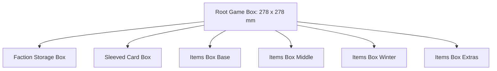

# Root Organizer Insert Specification

This document details the layout, component counts, compartment dimensions, and design rules for the **Root** board game organizer insert, ported from `examples/root.scad` to PythonSCAD.

---

## 1. Physical Box & Board Constraints

| Component | Width (mm) | Length (mm) | Height (mm) | Notes |
| :--- | :--- | :--- | :--- | :--- |
| **Main Game Box** | 290.0 | 290.0 | 82.5 | Outer dimensions of standard box. |
| **Playable Area (Interior)** | 278.0 | 278.0 | 79.5 | Wall clearance margins applied. |
| **Game Board** | 278.0 | 278.0 | 9.0 | Folded thickness, sits on top of inserts. |
| **Faction Boards** | 278.0 | 278.0 | 12.0 | Stack of 4–6 cardboard player boards. |

---

## 2. Component Inventory & Storage Sizing

### 2.1 Marquis de Cat
* **Color Scheme**: Orange (`#ff8c00`)
* **Warriors**: 25 meeples (stored in Marquis Box Bottom across 3 horizontal channels of length 73mm, 73mm, and 82mm, holding 8, 8, and 9 meeples with engraved warrior floor stamps and finger pull-outs).
* **Buildings & Tokens** (stored in Marquis Box Top):
  * 1 Keep token (round base, `18.5 x 18.5 x 2.0 mm` cardboard, centered keep tower icon).
  * 6 Sawmills (square cardboard buildings, `18.5 x 18.5 x 2.0 mm` each).
  * 6 Workshops (square cardboard buildings, `18.5 x 18.5 x 2.0 mm` each).
  * 6 Recruiters (square cardboard buildings, `18.5 x 18.5 x 2.0 mm` each).
  * 8 Wood Log tokens (diameter `15.0 mm`, cylindrical wood pieces).
  * 1 Score marker (square cardboard wreath token, `18.5 x 18.5 x 2.0 mm`).
  * *Pocket style*:
    * Keep: Custom outline shape cutout using [`keep.svg`](file:///Volumes/ExternalDocs/Documents/GitHub/pythonscad_boxes/boxes/root/svg/keep.svg) (depth `2.0mm`).
    * Wood logs: 2 circular pockets (`CIRCLE`, size `15.0x15.0mm`, depth `8.0mm` for 4-high stacks) with [`log.svg`](file:///Volumes/ExternalDocs/Documents/GitHub/pythonscad_boxes/boxes/root/svg/log.svg) floor stamps.
    * Score marker: 1 rectangular pocket (`RECT`, size `18.5x18.5mm`, depth `2.0mm`) with [`laurel_wreath.svg`](file:///Volumes/ExternalDocs/Documents/GitHub/pythonscad_boxes/boxes/root/svg/laurel_wreath.svg) floor stamp.
    * Sawmills: 2 rectangular pockets (`RECT`, size `18.5x18.5mm`, depth `6.0mm` for 3-high stacks) with [`saw.svg`](file:///Volumes/ExternalDocs/Documents/GitHub/pythonscad_boxes/boxes/root/svg/saw.svg) floor stamps.
    * Workshops: 2 rectangular pockets (`RECT`, size `18.5x18.5mm`, depth `6.0mm` for 3-high stacks) with [`anvil.svg`](file:///Volumes/ExternalDocs/Documents/GitHub/pythonscad_boxes/boxes/root/svg/anvil.svg) floor stamps.
    * Recruiters: 2 rectangular pockets (`RECT`, size `18.5x18.5mm`, depth `6.0mm` for 3-high stacks) with [`handshake.svg`](file:///Volumes/ExternalDocs/Documents/GitHub/pythonscad_boxes/boxes/root/svg/handshake.svg) floor stamps.

### 2.2 Eyrie Dynasties
* **Color Scheme**: Blue (`#1e90ff`)
* **Warriors**: 20 Warriors meeples (stored in Erie Box Bottom across 2 horizontal channels of length 91mm holding 10 meeples each, with engraved warrior floor stamps and finger pull-outs).
* **Buildings**:
  * 7 Roosts (square cardboard roost icons, `18.5 x 18.5 x 2.0 mm` each, stacked up to 4-high in a `8.0 mm` deep well).
* **Tokens**: None
* **Other Pieces**:
  * 4 Leader Cards (stored in Erie card box).
  * 2 Vizier Cards (stored in Erie card box).
* *Pocket style*:
  * Warrior: Cutout shape matching [`erie_warrior.svg`](file:///Volumes/ExternalDocs/Documents/GitHub/pythonscad_boxes/boxes/root/svg/erie_warrior.svg).
  * Roost: Cutout shape matching [`tree.svg`](file:///Volumes/ExternalDocs/Documents/GitHub/pythonscad_boxes/boxes/root/svg/tree.svg).

### 2.3 Woodland Alliance
* **Color Scheme**: Green (`#228b22`)
* **Warriors**: 10 meeples (stored in Alliance Box Bottom across 2 horizontal channels of length 46mm holding 5 meeples each, with engraved warrior floor stamps and finger pull-outs).
* **Bases**: 3 cardboard base tokens (Fox, Rabbit, Mouse, size: `18.5 x 18.5 x 2.0 mm` each).
* **Sympathy Tokens**: 10 circular cardboard tokens (diameter `18.5 mm`, thickness `2.0 mm`).
* *Pocket style*: Faction icon engravings:
    * Alliance Eyes: [`alliance_eyes.svg`](file:///Volumes/ExternalDocs/Documents/GitHub/pythonscad_boxes/boxes/root/svg/alliance_eyes.svg)
    * Sympathy Fist: [`fist.svg`](file:///Volumes/ExternalDocs/Documents/GitHub/pythonscad_boxes/boxes/root/svg/fist.svg)
    * Warrior: [`alliance_warrior.svg`](file:///Volumes/ExternalDocs/Documents/GitHub/pythonscad_boxes/boxes/root/svg/alliance_warrior.svg)

### 2.4 Lizard Cult
* **Color Scheme**: Yellow (`#ffd700`)
* **Warriors**: 25 meeples (stored in Lizard Box Bottom in a 5x5 grid of 25 individual standing warrior slots of size 18.0mm x 9.0mm, depth 20.0mm, with finger pull-outs).
* **Garden Buildings & Outcast Markers** (stored in Lizard Box Top):
  * 15 Garden buildings (5 Fox, 5 Rabbit, 5 Mouse square cardboard tiles, `18.5 x 18.5 x 2.0 mm`).
  * 1 Outcast marker, 1 Lost Souls marker.
* *Pocket style*:
  * Warrior: [`lizard_warrior.svg`](file:///Volumes/ExternalDocs/Documents/GitHub/pythonscad_boxes/boxes/root/svg/lizard_warrior.svg)
  * Lizard Eyes: [`lizard_eyes.svg`](file:///Volumes/ExternalDocs/Documents/GitHub/pythonscad_boxes/boxes/root/svg/lizard_eyes.svg)

### 2.5 Vagabond
* **Color Scheme**: Grey/Brown (`#808080`)
* **Meeples**: 1–2 meeples (size: `18.5 x 18.5 x 10.0 mm` each).
* **Items**:
  * 3 Ruin items, 4 starting items, plus expansion items (swords, boots, bags, teapots, coins, hammers, torches).
  * Square cardboard tokens measuring `18.5 x 18.5 x 2.0 mm` each.
  * *Pocket style*: Rectangular grids (pocket depth: `4.0 mm` for 2-high stacks, `2.0 mm` for single items) with engraved item icons:
    * Sword: [`sword.svg`](file:///Volumes/ExternalDocs/Documents/GitHub/pythonscad_boxes/boxes/root/svg/sword.svg)
    * Boot: [`boot.svg`](file:///Volumes/ExternalDocs/Documents/GitHub/pythonscad_boxes/boxes/root/svg/boot.svg)
    * Bag: [`bag.svg`](file:///Volumes/ExternalDocs/Documents/GitHub/pythonscad_boxes/boxes/root/svg/bag.svg)
    * Teapot: [`teapot.svg`](file:///Volumes/ExternalDocs/Documents/GitHub/pythonscad_boxes/boxes/root/svg/teapot.svg)
    * Coins: [`coins.svg`](file:///Volumes/ExternalDocs/Documents/GitHub/pythonscad_boxes/boxes/root/svg/coins.svg)
    * Hammer/Workshop: [`anvil.svg`](file:///Volumes/ExternalDocs/Documents/GitHub/pythonscad_boxes/boxes/root/svg/anvil.svg)
    * Torch: [`torch.svg`](file:///Volumes/ExternalDocs/Documents/GitHub/pythonscad_boxes/boxes/root/svg/torch.svg)

### 2.6 Winter Clearing Markers
* **Total**: 12 cardboard tokens (4 Fox, 4 Rabbit, 4 Mouse).
* **Dimensions**: Crescent/C-shaped tiles measuring `15.5mm x 29.5mm x 2.0mm`.
* **Arrangement**: Stood vertically in 6 slots (2 tokens stacked per slot, pocket depth: `5.0 mm`).
* **Markings**: 0.6mm deep, 8x8mm suit stamp inlays at the bottom of circular tabs.
  * Pocket Outline: [`winter_token.svg`](file:///Volumes/ExternalDocs/Documents/GitHub/pythonscad_boxes/boxes/root/svg/winter_token.svg)
  * Slots 0-1: Fox suit stamp [`fox_suit.svg`](file:///Volumes/ExternalDocs/Documents/GitHub/pythonscad_boxes/boxes/root/svg/fox_suit.svg)
  * Slots 2-3: Rabbit suit stamp [`rabbit_suit.svg`](file:///Volumes/ExternalDocs/Documents/GitHub/pythonscad_boxes/boxes/root/svg/rabbit_suit.svg)
  * Slots 4-5: Mouse suit stamp [`mouse_suit.svg`](file:///Volumes/ExternalDocs/Documents/GitHub/pythonscad_boxes/boxes/root/svg/mouse_suit.svg)

### 2.7 Riverfolk Company
* **Color Scheme**: Teal (`#008080`)
* **Warriors**: 15 meeples (stored in Riverfolk Box Bottom across 3 horizontal channels of length 46mm holding 5 meeples each, with engraved warrior floor stamps and finger pull-outs).
* **Trade Posts**: 9 Trade Posts (3 Fox, 3 Rabbit, 3 Mouse, circular cardboard tokens, diameter `18.5` mm, thickness `2.0` mm, stacked up to 5-high in 3 circular wells of depth `10.5` mm).
* **Glass Gems**: 3 Glass Gems (diameter `17.0` mm, thickness `9.0` mm, stored in 3 circular wells of depth `10.0` mm).
* **Score Marker**: 1 score marker (square cardboard wreath token, `18.5 x 18.5 x 2.0 mm`, stored in a rectangular well of depth `3.0` mm).
* **Faction Token**: 1 custom faction token (square cardboard, `18.5 x 18.5 x 2.0 mm`, stored in a rectangular well of depth `4.0` mm).
* *Pocket style*: Faction and token floor icons:
  - Warrior: [`riverfolk_warrior.svg`](file:///Volumes/ExternalDocs/Documents/GitHub/pythonscad_boxes/boxes/root/svg/riverfolk_warrior.svg)
  - Trade Posts: [`sign.svg`](file:///Volumes/ExternalDocs/Documents/GitHub/pythonscad_boxes/boxes/root/svg/sign.svg)
  - Glass Gems: [`gem.svg`](file:///Volumes/ExternalDocs/Documents/GitHub/pythonscad_boxes/boxes/root/svg/gem.svg)
  - Score Marker: [`laurel_wreath.svg`](file:///Volumes/ExternalDocs/Documents/GitHub/pythonscad_boxes/boxes/root/svg/laurel_wreath.svg)
  - Faction Token: [`riverfolk_eyes.svg`](file:///Volumes/ExternalDocs/Documents/GitHub/pythonscad_boxes/boxes/root/svg/riverfolk_eyes.svg)

---

## 3. Sub-Box Specifications

The insert is split into modular boxes arranged tightly in the main box footprint:

### 3.1 Items Box Winter (`ItemsBoxWinter`)
* **Box Dimensions**: `53.25mm x 103.5mm x 9.0mm`
* **Wall Thickness**: `2.0mm`
* **Lid Type**: Sliding lid with engraved "Winter" label.
* **Compartment Grid**: Single column of 6 rotated slots (`rotation = 90`).
  * **Pocket Size**: `15.5mm x 29.5mm` (accommodating unrotated `winter_token.svg`).
  * **Bottom Inlays**: Black suit stamp engravings (`fox_suit.svg`, `rabbit_suit.svg`, `mouse_suit.svg`).
  * **Finger Scoops**: Restricted to `12.0mm` width on the first and last slots to prevent cutting through the box's outer walls.

### 3.2 Items Box Bottom (`ItemsBoxBottom`)
* **Box Dimensions**: `53.25mm x 103.5mm x 10.0mm`
* **Lid Type**: Sliding lid with engraved "Items Bot" label.
* **Grid**: 10 slots configured for starting Vagabond items.
  * **Pocket Size**: `18.5mm x 18.5mm`
  * **Pocket Style**: 0.5mm corner-rounded rectangular pockets with Y-direction finger scoops.
  * **Bottom Inlays**: Black item stamp engravings:
    * Row 0: [`torch.svg`](file:///Volumes/ExternalDocs/Documents/GitHub/pythonscad_boxes/boxes/root/svg/torch.svg) (depth `4.0mm`), [`boot.svg`](file:///Volumes/ExternalDocs/Documents/GitHub/pythonscad_boxes/boxes/root/svg/boot.svg) (depth `6.0mm`)
    * Row 1: [`coins.svg`](file:///Volumes/ExternalDocs/Documents/GitHub/pythonscad_boxes/boxes/root/svg/coins.svg) (depth `2.0mm`), [`crossbow.svg`](file:///Volumes/ExternalDocs/Documents/GitHub/pythonscad_boxes/boxes/root/svg/crossbow.svg) (depth `4.0mm`)
    * Row 2: [`sword.svg`](file:///Volumes/ExternalDocs/Documents/GitHub/pythonscad_boxes/boxes/root/svg/sword.svg) (depth `6.0mm`), [`bag.svg`](file:///Volumes/ExternalDocs/Documents/GitHub/pythonscad_boxes/boxes/root/svg/bag.svg) (depth `2.0mm`)
    * Row 3: [`teapot.svg`](file:///Volumes/ExternalDocs/Documents/GitHub/pythonscad_boxes/boxes/root/svg/teapot.svg) (depth `4.0mm`), [`ruins.svg`](file:///Volumes/ExternalDocs/Documents/GitHub/pythonscad_boxes/boxes/root/svg/ruins.svg) (depth `6.0mm`)
    * Row 4: [`ruins.svg`](file:///Volumes/ExternalDocs/Documents/GitHub/pythonscad_boxes/boxes/root/svg/ruins.svg) (depth `6.0mm`), [`ruins.svg`](file:///Volumes/ExternalDocs/Documents/GitHub/pythonscad_boxes/boxes/root/svg/ruins.svg) (depth `4.0mm`)

### 3.3 Items Box Middle (`ItemsBoxMiddle`)
* **Box Dimensions**: `53.25mm x 103.5mm x 9.0mm`
* **Lid Type**: Sliding lid with engraved "Items Mid" label.
* **Grid**: 9 slots configured for Vagabond craftable items and ruins.
  * **Pocket Size**: `18.5mm x 18.5mm`
  * **Pocket Style**: 0.5mm corner-rounded rectangular pockets with Y-direction finger scoops.
  * **Bottom Inlays**: Black item stamp engravings:
    * Row 0: [`bag.svg`](file:///Volumes/ExternalDocs/Documents/GitHub/pythonscad_boxes/boxes/root/svg/bag.svg) (depth `4.0mm`), [`boot.svg`](file:///Volumes/ExternalDocs/Documents/GitHub/pythonscad_boxes/boxes/root/svg/boot.svg) (depth `4.0mm`)
    * Row 1: [`crossbow.svg`](file:///Volumes/ExternalDocs/Documents/GitHub/pythonscad_boxes/boxes/root/svg/crossbow.svg) (depth `2.0mm`), [`anvil.svg`](file:///Volumes/ExternalDocs/Documents/GitHub/pythonscad_boxes/boxes/root/svg/anvil.svg) (depth `2.0mm`)
    * Row 2: [`sword.svg`](file:///Volumes/ExternalDocs/Documents/GitHub/pythonscad_boxes/boxes/root/svg/sword.svg) (depth `4.0mm`), [`teapot.svg`](file:///Volumes/ExternalDocs/Documents/GitHub/pythonscad_boxes/boxes/root/svg/teapot.svg) (depth `4.0mm`)
    * Row 3: [`coins.svg`](file:///Volumes/ExternalDocs/Documents/GitHub/pythonscad_boxes/boxes/root/svg/coins.svg) (depth `4.0mm`), [`ruins.svg`](file:///Volumes/ExternalDocs/Documents/GitHub/pythonscad_boxes/boxes/root/svg/ruins.svg) (depth `4.0mm`)
    * Row 4: [`ruins.svg`](file:///Volumes/ExternalDocs/Documents/GitHub/pythonscad_boxes/boxes/root/svg/ruins.svg) (depth `4.0mm`), (empty slot)

### 3.4 Marquis Box Bottom (`MarquisBoxBottom`)
* **Box Dimensions**: `106.5mm x 59.833mm x 24.5mm`
* **Lid Type**: Cap lid with multi-color Marquis de Cat faction logo.
* **Warriors Grid**: 3 horizontal channels running along the X axis holding 25 cat meeples, separated by 3.9mm wide dividing walls with finger pull-outs spanning the long length of each channel:
  * Channel 1 (`Y = 9.5mm`): size `73.0mm x 14.5mm`, depth `18.0mm` (holds 8 meeples) with [`marquis_warrior.svg`](file:///Volumes/ExternalDocs/Documents/GitHub/pythonscad_boxes/boxes/root/svg/marquis_warrior.svg) floor stamp and 65mm long finger pull-out.
  * Channel 2 (`Y = 27.9mm`): size `73.0mm x 14.5mm`, depth `18.0mm` (holds 8 meeples) with [`marquis_warrior.svg`](file:///Volumes/ExternalDocs/Documents/GitHub/pythonscad_boxes/boxes/root/svg/marquis_warrior.svg) floor stamp and 65mm long finger pull-out.
  * Channel 3 (`Y = 46.3mm`): size `82.0mm x 14.5mm`, depth `18.0mm` (holds 9 meeples) with [`marquis_warrior.svg`](file:///Volumes/ExternalDocs/Documents/GitHub/pythonscad_boxes/boxes/root/svg/marquis_warrior.svg) floor stamp and 75mm long finger pull-out.

### 3.5 Eyrie Box Bottom (`ErieBoxBottom`)
* **Box Dimensions**: `106.5mm x 59.833mm x 24.5mm`
* **Lid Type**: Cap lid with multi-color Eyrie Dynasties faction logo.
* **Warriors Grid**: 2 horizontal channels running along the X axis holding 20 bird meeples:
  * Channel 1 (`Y = 16.0mm`): size `91.0mm x 22.0mm`, depth `18.0mm` (holds 10 meeples) with [`erie_warrior.svg`](file:///Volumes/ExternalDocs/Documents/GitHub/pythonscad_boxes/boxes/root/svg/erie_warrior.svg) floor stamp and finger pull-out.
  * Channel 2 (`Y = 41.5mm`): size `91.0mm x 22.0mm`, depth `18.0mm` (holds 10 meeples) with [`erie_warrior.svg`](file:///Volumes/ExternalDocs/Documents/GitHub/pythonscad_boxes/boxes/root/svg/erie_warrior.svg) floor stamp and finger pull-out.

### 3.6 Woodland Alliance Box Bottom (`AllianceBoxBottom`)
* **Box Dimensions**: `53.25mm x 59.833mm x 25.5mm`
* **Lid Type**: Cap lid with multi-color Woodland Alliance faction logo.
* **Warriors Grid**: 2 horizontal channels running along the X axis holding 10 alliance meeples:
  * Channel 1 (`Y = 16.0mm`): size `46.0mm x 19.5mm`, depth `18.0mm` (holds 5 meeples) with [`alliance_warrior.svg`](file:///Volumes/ExternalDocs/Documents/GitHub/pythonscad_boxes/boxes/root/svg/alliance_warrior.svg) floor stamp and finger pull-out.
  * Channel 2 (`Y = 41.5mm`): size `46.0mm x 19.5mm`, depth `18.0mm` (holds 5 meeples) with [`alliance_warrior.svg`](file:///Volumes/ExternalDocs/Documents/GitHub/pythonscad_boxes/boxes/root/svg/alliance_warrior.svg) floor stamp and finger pull-out.

### 3.7 Lizard Box Bottom (`LizardBoxBottom`)
* **Box Dimensions**: `106.5mm x 59.833mm x 26.5mm`
* **Lid Type**: Cap lid with multi-color Lizard Cult faction logo.
* **Warriors Grid**: 5x5 grid of 25 individual standing warrior slots:
  * **Slot Dimensions**: `18.0mm x 9.0mm`, depth `20.0mm`.
  * **Columns along X**: X centers at `13.65mm`, `33.45mm`, `53.25mm`, `73.05mm`, `92.85mm` (pitch `19.8mm`).
  * **Rows along Y**: Y centers at `9.916mm`, `19.916mm`, `29.916mm`, `39.916mm`, `49.916mm` (pitch `10.0mm`).
  * **Grips**: Each slot includes a finger pull-out for simple retrieval of standing warriors.

### 3.8 Riverfolk Box Bottom (`RiverfolkBoxBottom`)
* **Box Dimensions**: `53.25mm x 59.833mm x 26.5mm`
* **Lid Type**: Cap lid with multi-color Riverfolk Company faction logo.
* **Warriors Grid**: 3 horizontal channels running along the X axis holding 15 otter meeples:
  * Channel 1 (`Y = 12.0mm`): size `46.0mm x 15.0mm`, depth `18.0mm` (holds 5 meeples) with [`riverfolk_warrior.svg`](file:///Volumes/ExternalDocs/Documents/GitHub/pythonscad_boxes/boxes/root/svg/riverfolk_warrior.svg) floor stamp and finger pull-out.
  * Channel 2 (`Y = 29.916mm`): size `46.0mm x 15.0mm`, depth `18.0mm` (holds 5 meeples) with [`riverfolk_warrior.svg`](file:///Volumes/ExternalDocs/Documents/GitHub/pythonscad_boxes/boxes/root/svg/riverfolk_warrior.svg) floor stamp and finger pull-out.
  * Channel 3 (`Y = 47.8mm`): size `46.0mm x 15.0mm`, depth `18.0mm` (holds 5 meeples) with [`riverfolk_warrior.svg`](file:///Volumes/ExternalDocs/Documents/GitHub/pythonscad_boxes/boxes/root/svg/riverfolk_warrior.svg) floor stamp and finger pull-out.

---

## 4. Pocket & Finger Scoop Design Rules

1. **Token Clearance**: All custom SVG and rectangular token pockets must include a minimum of `0.2mm` side clearance to prevent cardboard binding.
2. **Default Corner Rounding**: Square/rectangular pockets (`ElementShape.RECT`) automatically apply a configurable `0.5mm` vertical corner rounding.
3. **Engraved Inlays**: Colored floor inserts are carved 0.6mm deep into the pocket floor and printed flush in a secondary material (e.g. black PLA).
4. **Scoop Width Bounds**: Horizontal finger scoops along X must have their widths (`across`) restricted near boundary walls (less than 15mm clearance) to avoid piercing the outer `2.0mm` box walls.
5. **Floor Icons**: All token pockets must have their respective token icons engraved in the bottom of the pockets (depth=0.6mm, flush in secondary color) to aid in component sorting and setup.
6. **Sliding Lid Direction**: All sliding lids default to sliding along the length axis of the box (Y axis) to maintain consistent layout alignment across the entire insert.
7. **Lid Patterns & Icons**: Lids default to a dense hexagonal pattern. For the Root project specifically, the lids use a square pattern (matching the original SCAD design) with multi-colored faction logo inserts (Marquis de Cat, Eyrie Dynasties, Lizard Cult, Riverfolk Company, Vagabond) generated from SVG assets. Faction card boxes (Shared, Erie, Vagabond) carry both their respective faction logos and text labels.

